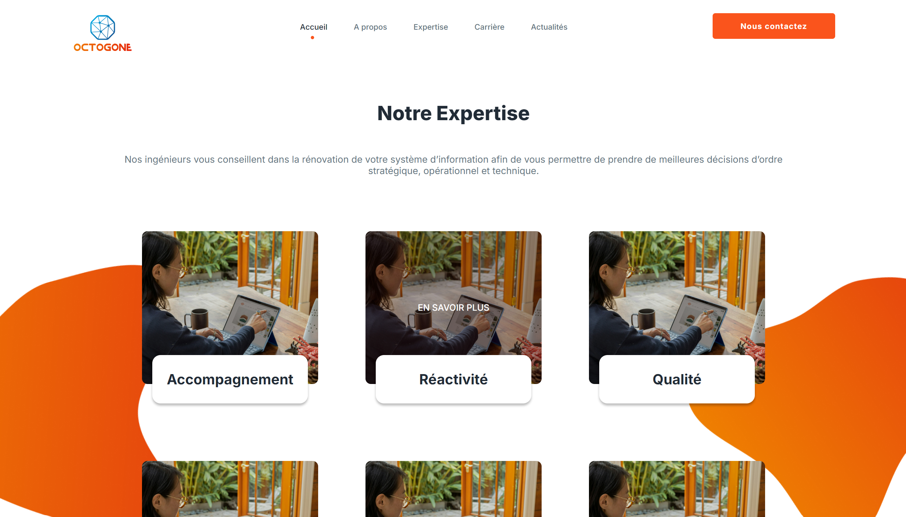

# Octogone

Octogone est un site web de présentation.

## Fonctionnalités principales

- **Interface utilisateur intuitive** avec une esthétique moderne et une charte graphique cohérente

## Technologies utilisées

- HTML5
- CSS3 (avec Flexbox pour la mise en page)

## Captures d'écran

### Homepage - page d'accueil

## Installation et utilisation

[GitHub Pages - lien vers le site](https://riskooooo.github.io/octogone/)

1. Clonez ce dépôt sur votre machine locale
2. Ouvrez le fichier `index.html` dans votre navigateur

## Contribution

Les contributions à ce projet sont fermées, car ce projet a été réalisé dans le but de rester dans son état actuel à des fins personnelles.